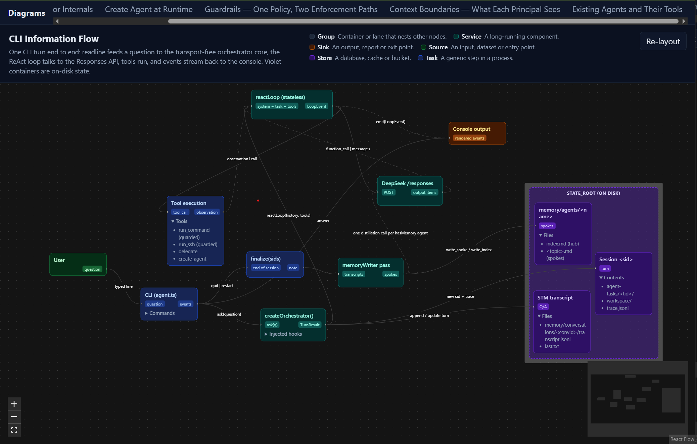

# Semantic JSON → Diagram Visualizer

Read-only viewer that turns a JSON file into an interactive, auto-laid-out
React Flow diagram. Drop a file in `src/diagrams/`, reload, done — no registry,
no coordinates, no code changes.



See `docs/prd.md` for the full design.

To see examples copy diagrams from `skills/create-diagram-files/assets` to `src/diagrams/` and start app.


## Agent skill

You can use attached skill to have your agent generate and validate diagrams 
that show anything you need to see in your code IE architecture, information flow, class relations...
Your imagination is the boundary.

`skills/create-diagram-files/` is self-contained and can be copied into another
project. Point an agent at `SKILL.md`; it will write a diagram and run its own
validator:

```sh
npm run validate              # default src/diagrams/
npm run validate -- <dir>     # custom directory
npx tsx skills/create-diagram-files/scripts/validate.ts <dir>  # direct
npx tsx skills/create-diagram-files/scripts/validate.ts --self-test  # check the checker
```


## Commands

```sh
npm install
npm run dev        # http://localhost:5173
npm run validate   # check src/diagrams/ (add `-- <dir>` for another dir)
npm run build      # tsc -b && vite build
```

## Adding a diagram

1. Write `src/diagrams/<id>.json` following `skills/create-diagram-files/references/schema.md`
   (or copy one of `skills/create-diagram-files/assets/*.json`).
2. `npm run validate` and fix any errors.
3. Reload the app. The file appears in the topbar with its own page at `/d/<id>`.

Malformed diagrams still appear in the topbar, marked `!`, and route to a page
listing their validation errors — a bad file never silently disappears.

## Layout

```
src/
  App.tsx            router + shell
  Topbar.tsx         derived from diagram metas
  DiagramPage.tsx    header + legend + ReactFlow + error panel
  loader.ts          Vite glob + parse + validate + sort
  nodes/             kind -> component registry and node bodies
  lib/               schema, kinds, palette, validate, ELK layout, flow builder
  diagrams/*.json    the content
skills/create-diagram-files/  portable agent skill
  scripts/validate.ts         self-contained validator (no project imports)
```
